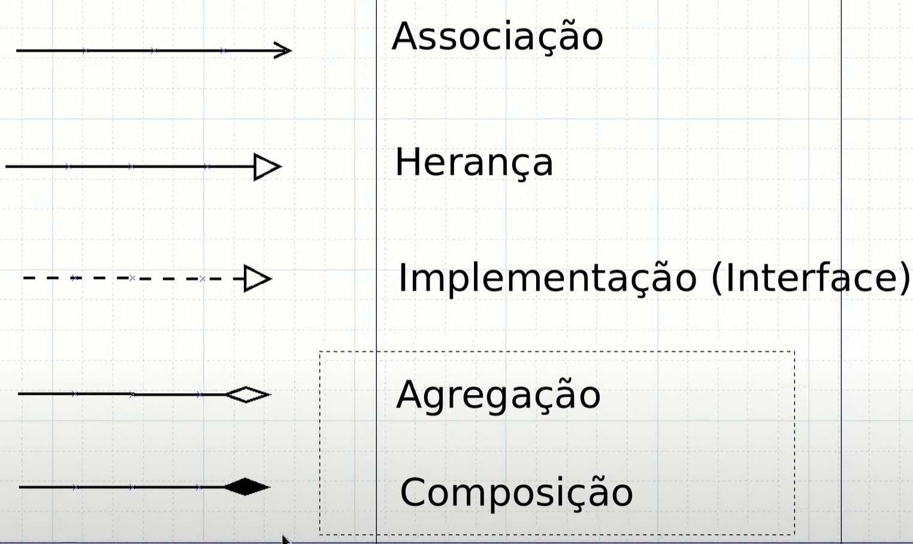
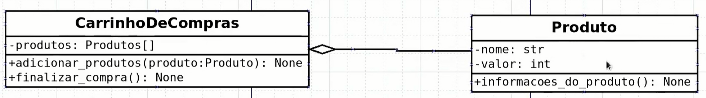

# POO 
https://www.youtube.com/watch?v=d6mXFH9C4LY&list=PLAgbpJQADBGK8EemmTEoIwW08bXCjfSuA&index=1

# UML
- Exemplos abaixo para explicar o como representar um UML para POO.

- Representações convencionadas de setas no UML de classes para POO:

## Aula 03:

- Sinal de "+" indica que o atributo ou método é público
## Aula 04:

- Sinal de "-" indica que o atributo ou método é privado 
## Aula 08a:

- O sublinhado no atributo e metodo está mostrando que eles sofrem alterações de classmethod, ao qual variaveis da minha classe altera dados dos meus objetos devido aos objetos estarem usando a variavel da classe.

## Aula 10:

 - A seta cheia com ponta aberta indica a associação da classe pessoa com interruptor

 ## Aula 12: 
 
 - Este caso representa uma situação que a classe pessoa possui um injeção de dependência com a classe celular em atr, sendo assim não existe uma pessoa sem existir uma classe celular. Diferente do que acontence no exemplo da Aula 10.

 ## Aula 14:
 
- Na repr de **Heranças** em UML, teremos uma seta de **Linha Fechada** e **Seta Aberta** que repr a herança de mamifero para Gato e Cachorro.

## Aula 15:

- Na repr de atributos protegidos apenas por convenção, isto é, o python não levanta uma excesão, o atributo é repr no UML como um **#** como no método **#dormir()**

## Aula 17:

- A classe abstrata server como contrato para as classes que a herdarão, isto é, eu sou obrigado a implementar os mesmos métodos que a classe abstrata possui, isto permitirá um melhor controle da estrutura do código. No UML ela é representada por o nome da classe em **negrito** e o nome do método em **negrito**. Elas podem ser utilizadas como interfaces.

- Implementação da interface via Classe Abstrata

## Aula 20:

- Neste princípio da inversão de independência, podemos ver que temos a represenação de uma ligação de herança(linha fechada e seta aberta) de cls Principal herdando da interface do elemento e há outras duas classes sendo implementadas via classe abstradas através da interface ao qual elas herdam a interface também. Temos a inversão de independência quando então instanciamos as classes elemento e elemento_outro via obj fora da classe no programa principal.

## Aula 21:

- **Agregação**, representada pelo losangulo aberto, normalmente agregações são compostos por lista de objetos, neste caso produto é agregado em carrinho.

## Aula 22:

- **Composição**, representada por um losangulo *fechado*. Neste exemplo eu componho uma classe de outra classe, no exemplo da aula, eu tenho o repositorio que recebe a estrutura do cmd de outra classe. Neste exemplo, não carregamos no construtor a outra classe mas sim diretamente no atributo.

## Classes, atributos e Metodos

- **Classe** são contextos que representam uma abstração de algo do mundo real ou sistema
    - Sempre escrito com a primeira letra de cada palavra em Maíusculo
- **Atributos** são características das classes
- **Metodos** são as ações de cada classe

## SOLID

- A POO precisa respeita os princípios do SOLID, que são:
    - **S** - Sigle Responsability, isto é, um módulo, classe ou metodo deve ter apenas uma única responsabilidade sobre a funcionalidade exercida pelo software. Ele deve ter um único objetivo. 
    - **O** - Princípio aberto fechado, estebelece que as entidades da classe pode ser aberto para extensão, mas fechado para modificações. Isto é, a entidade pode ter seu comportamento extendido sem alterar seu código fonte. #REF-Aula 11 e 11a.
    - **L** - Substituição de **LISKOV**, diz que objetos podem ser substituídos por seus subtipos (classes herdeiras) sem que isto afete a execução do programa.
    - **I** - Segregação das Interfaces, é não utilizar uma interface em que a classe não se utilizará totalmente de seus métodos. Caso contrário preciso fazer outra interface.
    - **D** - Inversão da Dependência, é a dependência mais branda entre as classes, isto é, as classes se relacionam através das interfaces sendo suas instâncias construídas fora de cada classe.

## POLIMORFISMO

- É o fato do mesmo método se comportando de maneiras diferentes de acordo com o contexto que ele é chamado.

