# Fundamentos de Programação com C#
## Array

- Estrutura de armazenamento de tamnho fixo em implementação nativa CLR, do mesmo tipo
- Ele é um conjunto contiguo de elementos na memória  e é herdado da class System.Array
- Dentro dos array nós temos coleções como pilhas, filas...
- Mesmo sendo de uma classe, ela implementa algumas "interfaces" do universo da collection
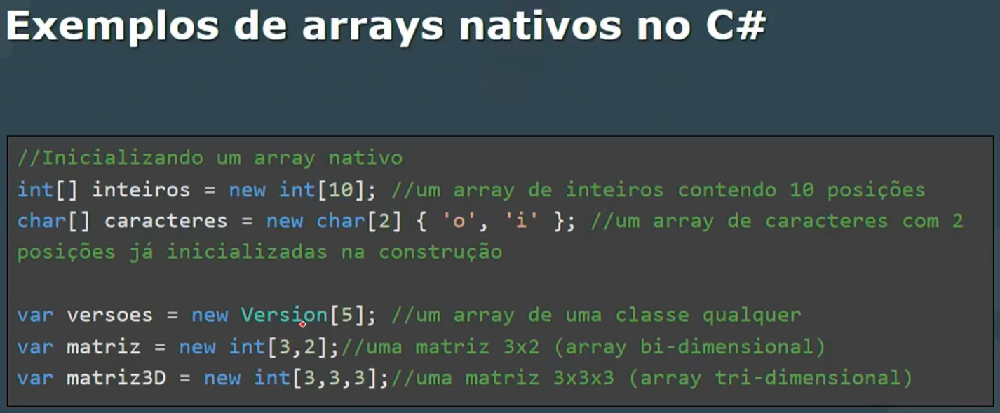
- Um array não pode aumentar de tamanho

## Generics
- Mecanicanimos para auxiliar na reutilização de códigos com Heranças e Genéricos
- Eles são como templates, o uso de generics é representado como "<T>"
- Exemplo de uma Pilha Customizada usando "Generics"
- O "T" podem ser substituido por qualquer type desde que seja em tempo de compilação do código
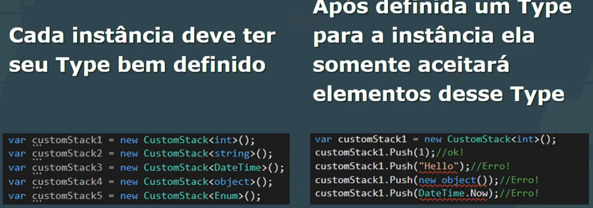
- A vantagem de trabalhar com uma "Generic" ao invés de uma "OBJ" é que quando manipulo uma array, eu preciso me atentar ao type do dado, caso contrário posso levantar uma excessão caso não defina o que estou manipulando em caso de estar mexendo em array com mais de um tipo de dado.
- Há maneira de limitar os Generics com constraints, como o exemplo abaixo:
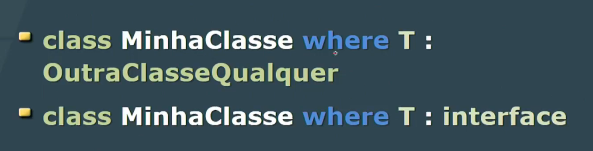
    - Neste caso os ":" são utilizados para herança ou implementação 
    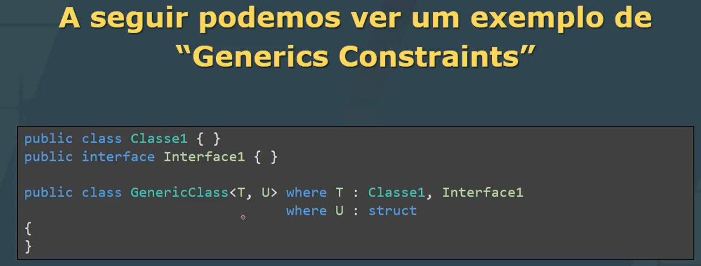 

## Arrays, List, Sets, Dicts e Collections

- A Colection IEnumerator é uma protocolo que percorre um array de maneira sequencial:
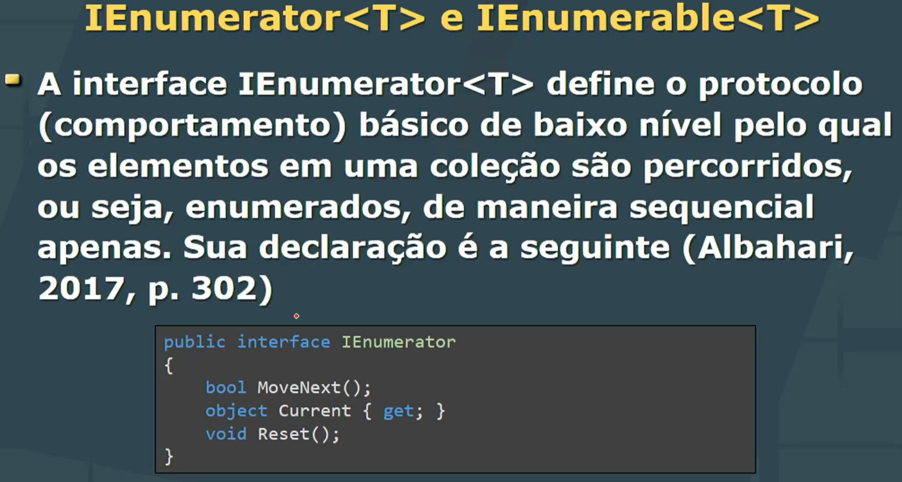
- Sempre que utilizamos o IEnumarable, ele gera internamente um IEnumarator para enumerar os itens para percorrer o array
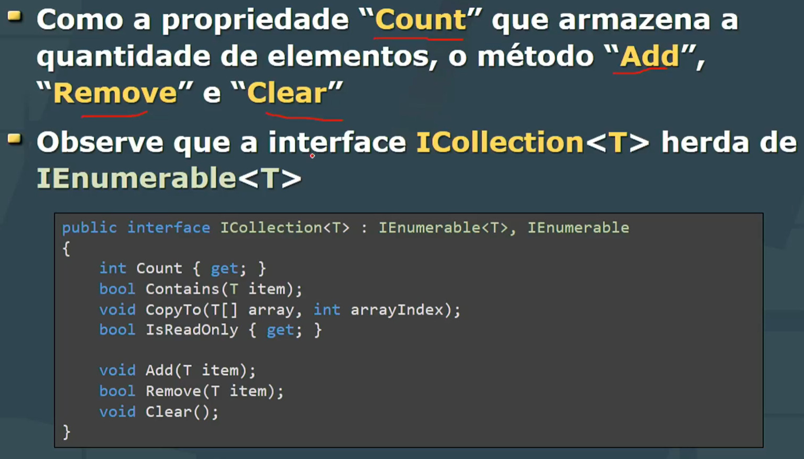
- A interface IList permite acessarmos:
    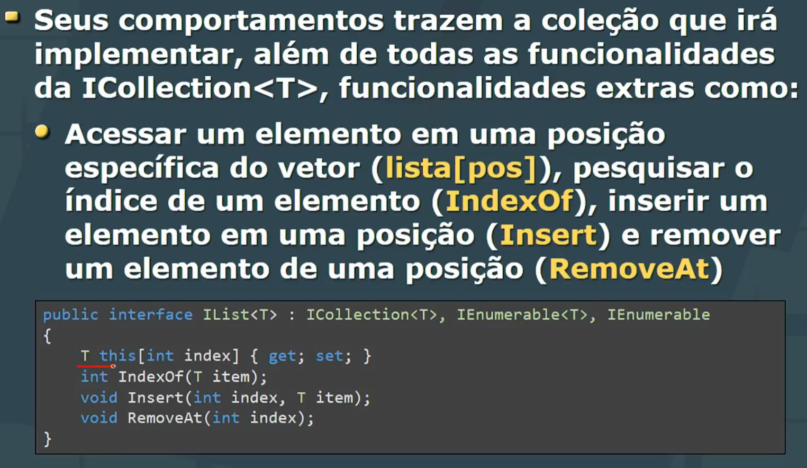
- HashSet é uma class que implementa um array que guarda o valor e sua posição, sua característica é de não permitir a duplicação de elementos e sua performance é excelente
- As Dict é uma estruct:    
    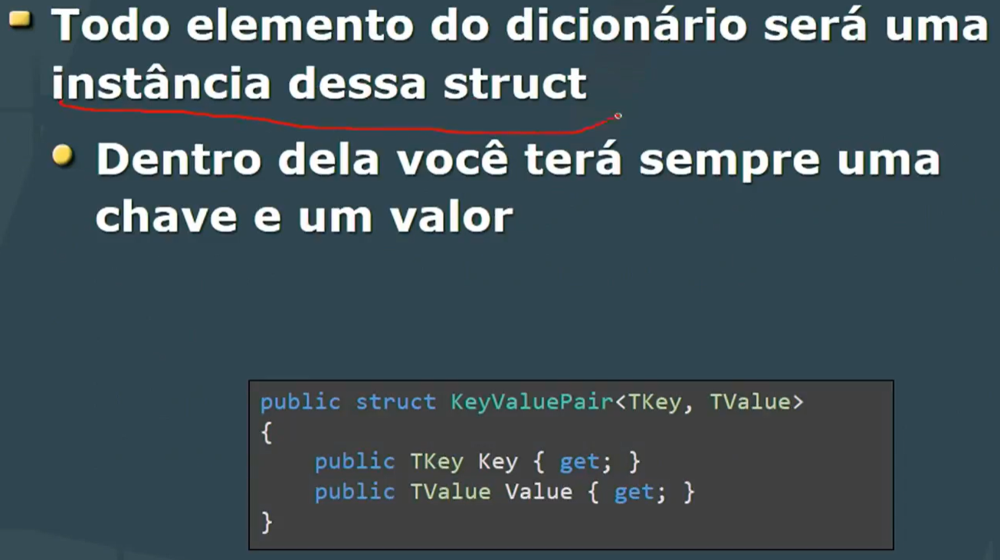
- 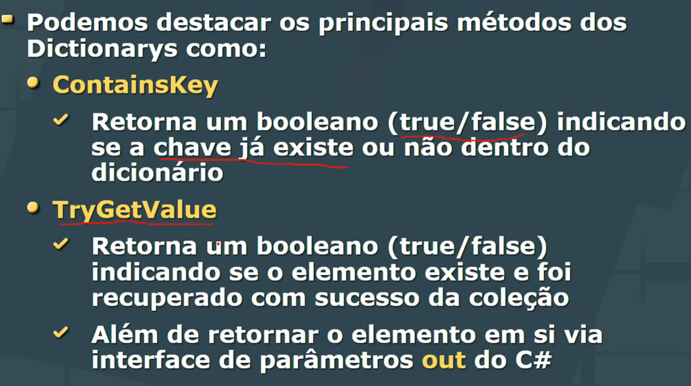

## Conversões entre Collection

- Todas as Collection são armazenados em Array

## LINQ

- LINQ permite que consulte qualquer coleção que implemente IEnumerable<T>, Array, Lista ou XML DOM, fontes de dados remota, BD SQL. Ele é a unificação da tipagem em tempode compilação e composição de consultas dinâmicas em coleções.
- Há dois de notações para LINQ:
    - Fluent Syntax
        - É a principal forma de percorrer uma Collection ou filtrar uma Collection
        -----------------------
        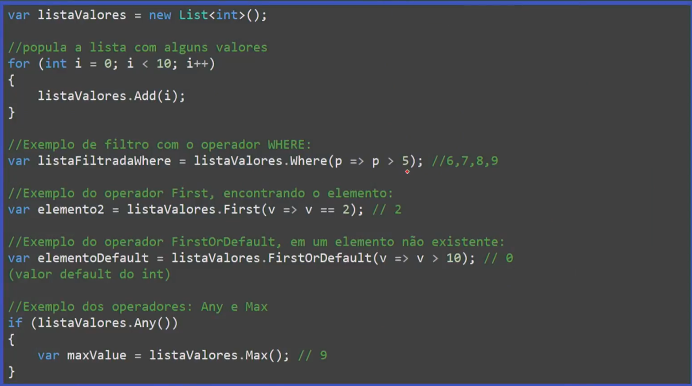
        -----------------------
        - Nesta notação podemos encadear os operadores em uma forma de *PIPELINE*,  (uma espécie de fluxo ou esteira dos dados), com os operadores podemos: **Filtrar, Ordenar, Agregar, Agrupar, Unir e Converter**
        -----------------------
        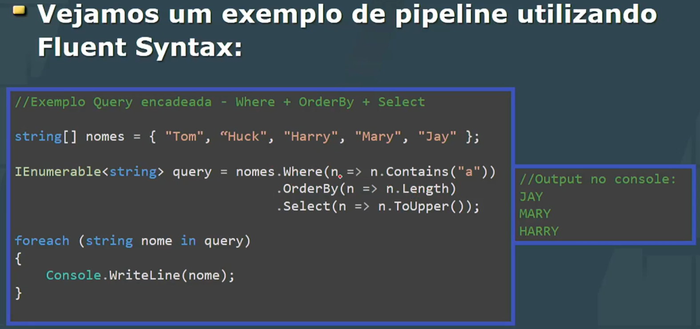
        -----------------------
        - Importante destacar que sempre que a Function tiver **2 param**, o primeiro será o de entrada e o segundo o de retorno da function, como o exemplo abaixo, o retorno será um boleano:
        -----------------------
        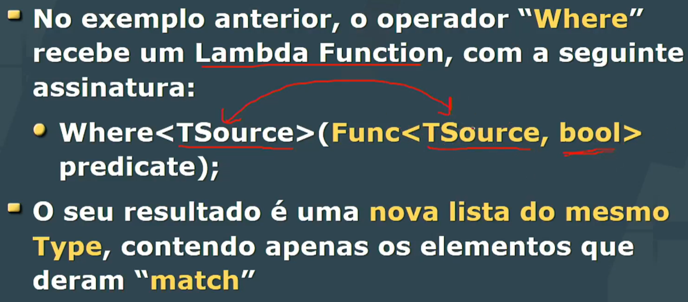

        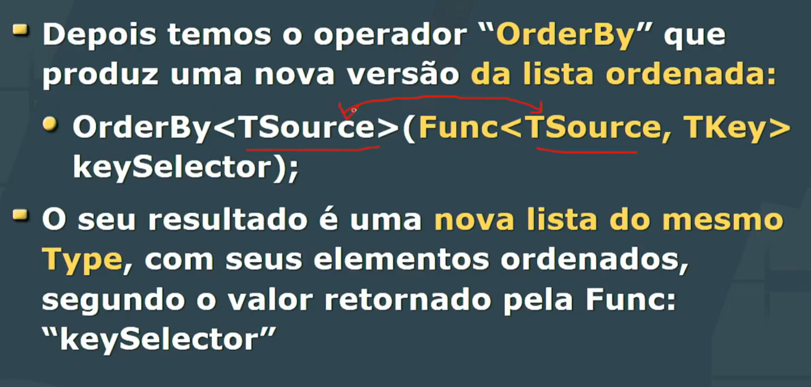
        -----------------------
        - Um operador de consulta LINQ **NUNCA** altera a sequência de entrada, ele só retornará uma nova sequência de dados, mas respeitando a primeira.
        - Também posso ter uma entrada "T" e uma saída "Y" na tipagem de dados, o ex abaixo mostra uma entrada em STR leio os items da listar e retorno os comprimentos de cada dado, sua saída está sendo convertida para um INT por isto que ele está dentro de <> e ainda está sendo implementado um IEnumerable para podermos interar sobre ela.
        -----------------------
        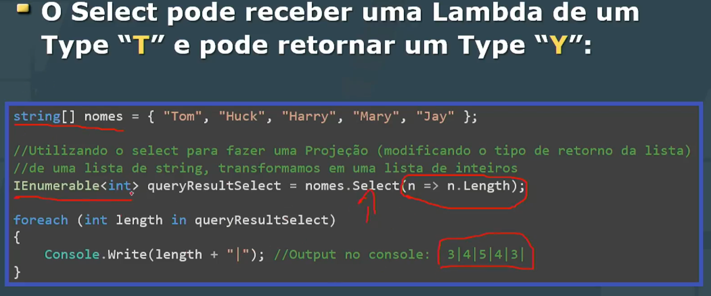
        -----------------------

    - Query Expression
        - Síntaxe parecida como escrever SQL. Abaixo um exemplo parecido com o de cima.
        ------------------------
        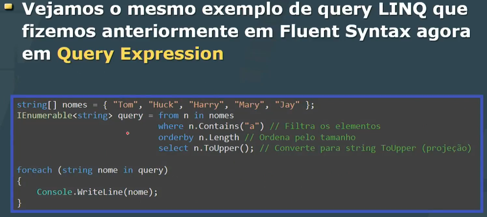

        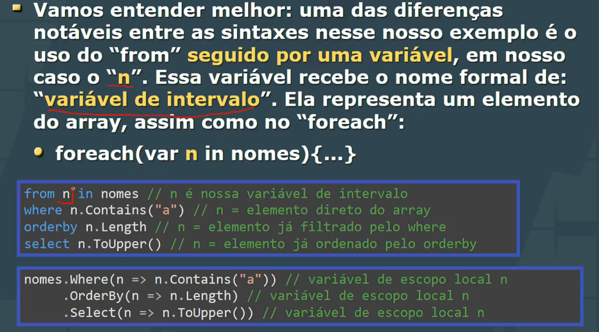
        - No exemplo abaixo estamos utilizando um mix das duas linguagem, na funcao **mixQueries**, estamos:
            - percorrendo um "N" in uma "ARRAY"
            - Executando um JOIN do NOMEY in um novo ARRAY
            - Este segundo array vem um uma função lambda que retorna palavras que contem a letra Y
            - O join jogará o resultado de N sobre as palavras igual do resultado de NOMEY
            - Depois ele seleciona o resultado para elementos que possui mais que 3 letras com WHERE
            - E por fim jogamos o resultado para maiusculo com n.ToUpper e ordenamos de forma descrescente
            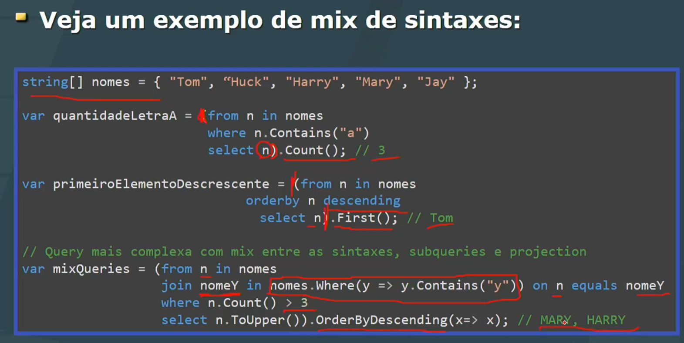

- No LINQ é impressendível trabalharmos com LAMBDA que podemos ter as seguintes expressões:
    - (input-param) => expression
    - (input-param) => { <sequencia de codigo>}
- Há dois métodos de encapsulamento:
    - ACITION e ACTION<T> - este pode receber param e *não retornar* valores
    - FUNC<T> - este pode receber param e *retornar* _valores_

## Execução Tardia ( Deffered Execution ou Lazzi Execution)

- Conceito deste tipo de execução é que ela não é executada no momento que é construída, é executada somente após chamarmos ela. O exemplo abaixo define isto, CORREÇÃO, no lugar da query em foreach, é o nome do segundo VAR:
    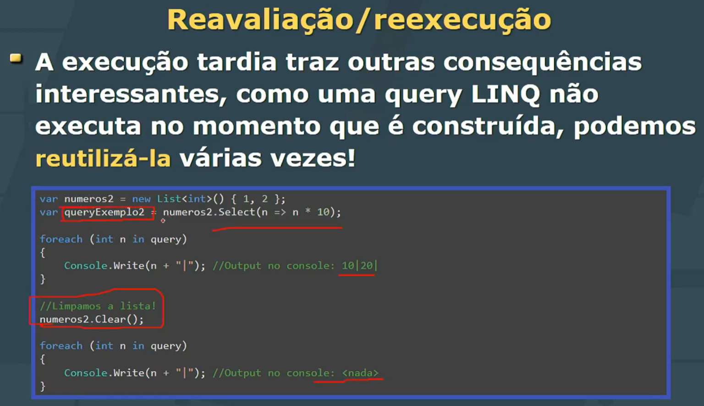
    - Assim podemos reutiliza-la e reprogramar os dados dentro dela sempre que precisarmos

- Agora se queremos mantê-la integra, precisamos aplicar o Tolist ou ToArray, como este caso, que força uma nova coleção interna:
    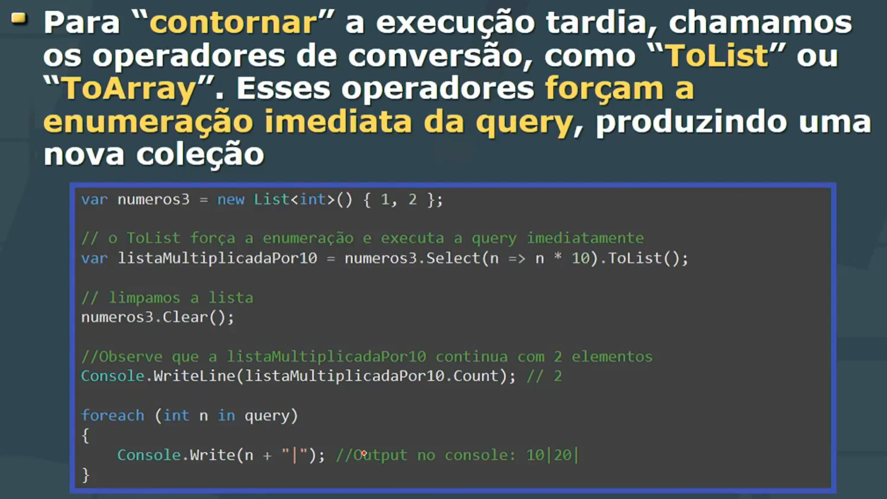

## Operadores LINQ

- Há 3 tipos de categorias de operadores:
    - "Coleção in", "Coleção Out"
    - "Coleção in", "Elemento Out"
    - Sem param, "Coleção Out"

- **Operadores de filtro**, sempre retornarão com dados na mesma qtd ou menor e sempre do mesmo TYPE:
    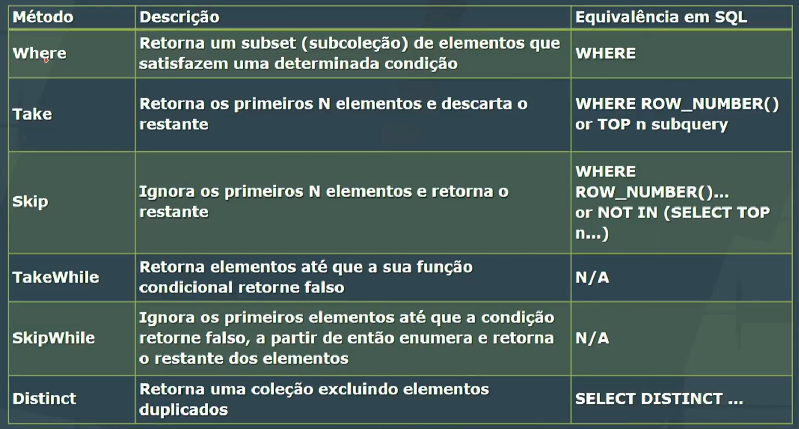

- **Operadores de Projeção**, Transforma o TYPE de entrada e um novo TYPE de saída
    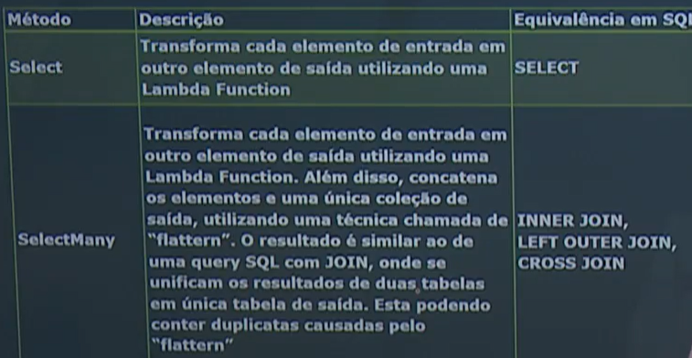
    - Um operador SELECT pode retornar um TYPE ANÔNIMO que é um SYSTEM.OBJECT que possui apenas propriedades criadas em tempo de execução, para isto ele precisa ser combinado com a palavra "newm {...}"
    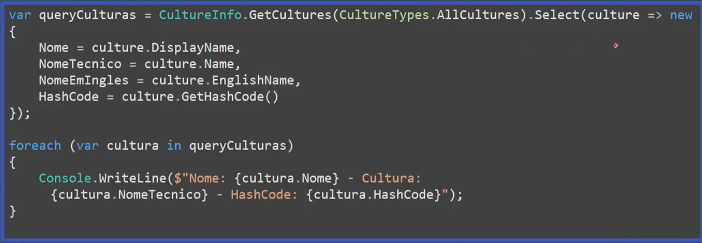
    OBS.: CULTUREINFO é as linguagens instaladas no computador. Neste caso estamos montando um objeto com suas propriedades. Importante: **Neste tipo de objeto não conseguimos altera-lo e nem atribuir valores para suas propriedades**

- **Operadores de combinação**
    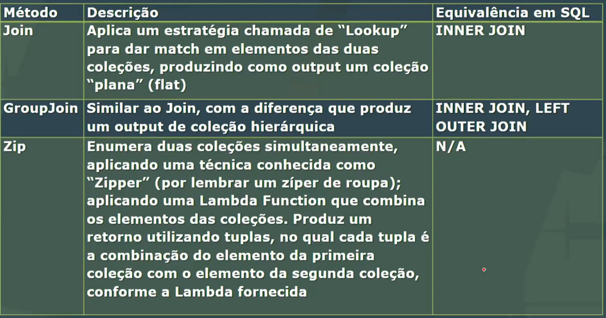

- **Operadores de ordenação**
    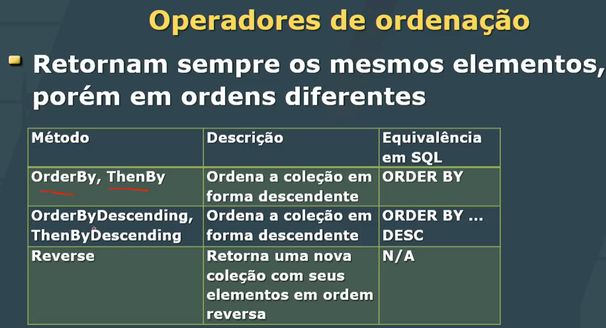

- **Operadores de conversão**, a grande maioria implementarão a coleção uma enumeração aos dados
    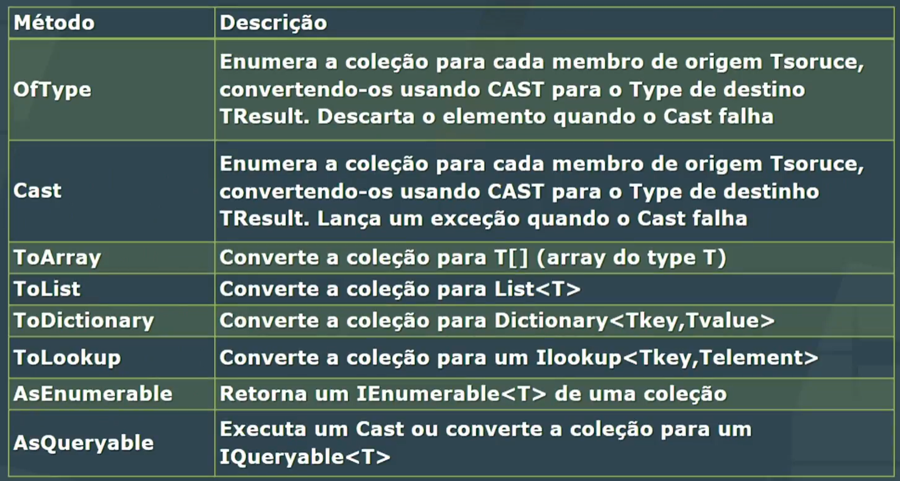

- **Operadores de agregação**
    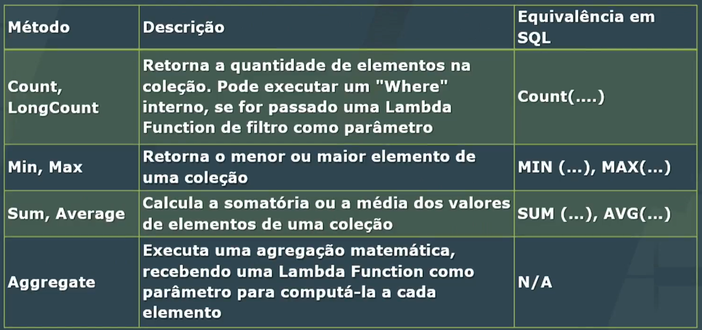
    