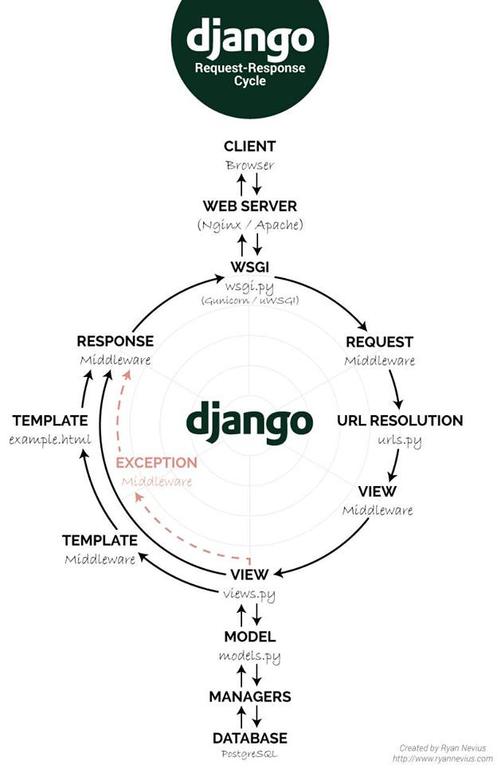

# Fluxo do Django para iniciantes
    1 - criar uma venv
    2 - abrir projeto django > django-admin startproject 'nome do projeto'
    3 - manage.py sera o caminho dos comando
    4 - settings fica os apps que crio, pastas de templates e demais configs
    5 - 'python manage.py runserver' para iniciar o servidor
    6 - urls.py e onde fica as rotas que encaminha para as pages
        esta fica sempre na url do projeto que encaminha para a primeira
        url do primeiro app, dele ha outra url.py para fazer novos direcionamentos
    7 - apos e necessario criar as views que possui as funcoes necessarias 
        para requisitar as pages
    8 - dentro dos apps e necessario criar as pastas templates e dentro dela
        criar um template base que servira de padrao para as outras pages. Dentro
        dele havera uma pasta com o mesmo nome do app e os html necessario para o app
    9 - o css e js precisam ficar na pasta static dentro do app, cada um em sua pasta
    10 - importante, e indicado usar o bootstrap e FontaAwesome no base.html para agilizar 
        o processo de criacao
    11 - Apos criamos as class em models que recebem a definicao de dados que irao
        para o BD e a tipagem do mesmo
    12 - necessario registrar os models que foram criado no 'admin.py'
    13 - "python manage.py migration' e o cmd para o django criar a pasta migration e
        dentro dela criar as instrucoes para criacao dos dados e tabela que vem do models
    14 - Apos criar o BD e necessario cria o usuario com o 'python manage.py createsuperuser'
    15 - Formularios no Django e necessario criar dentro do app um arquivo 'forms.py' que e
        necessario importar o forms e tambem o .models buscando a funcao necessario, ele usa
        o models para formatar e pegar os dados do formulario. A vantagem e que eu nao preciso fazer ele se adequar as entradas de dados no html, ele ja recebe do html e 
        formata o dado.
    16 - No html eu preciso usar um  dentro do .form com method post
    XX - Desenho do fluxo 

